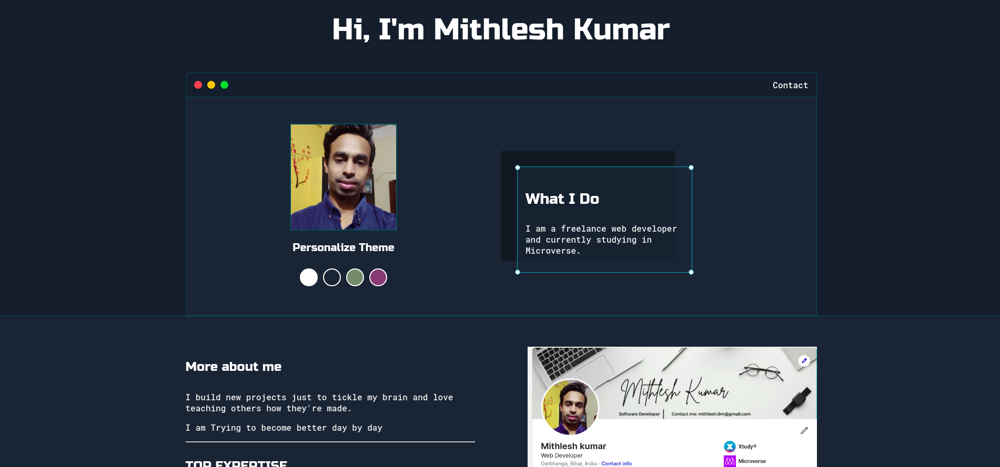

# Portfolio.

> Portfolio.



## Built With

- HTML
- CSS
- JavaScript
- Git and GitHub

## Deploy Link


## Getting Started

To get a local copy up and running follow these simple example steps.

### Prerequisites
- You should have basic knowledge of HTML
- You should have basic knowledge of CSS
- Also, a basic knowledge of git and github
- A code editor: I used VScode for this project but you can use any code editor of your choice
### Setup
- follow steps on this link to set up VScode code editor: [setup vscode](https://www.freecodecamp.org/news/how-to-set-up-vs-code-for-web-development/)

### Install
[download](https://code.visualstudio.com/download) VScode.
[Watch this video](https://www.youtube.com/watch?v=MlIzFUI1QGA) on how to install VScode on windows

### Usage

Clone project, run in your terminal:

```$ git clone git@github.com:Mithi-code/portfolio.git ```

Open the cloned project in your code editor and run:

``` $ cd portfolio ```

## Author 1

- GitHub: [@githubhandle](https://github.com/Mithi-code)
- Twitter: [@twitterhandle](https://twitter.com/LazyMithlesh)
- LinkedIn: [LinkedIn](https://www.linkedin.com/in/mithlesh-kumar-564a97221/)

## 🤝 Contributing

Contributions, issues, and feature requests are welcome!

Feel free to check the [issues page](https://github.com/Mithi-code/portfolio/issues).

## Show your support

Give a ⭐️ if you like this project!

## Acknowledgment 
- Microverse 

## 📝 License

This project is [MIT](./MIT.md) licensed.